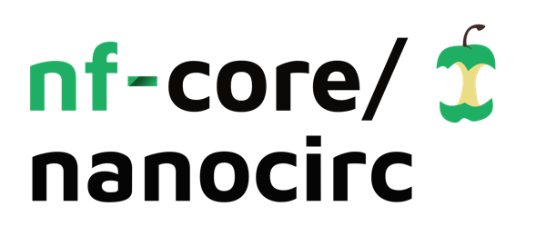
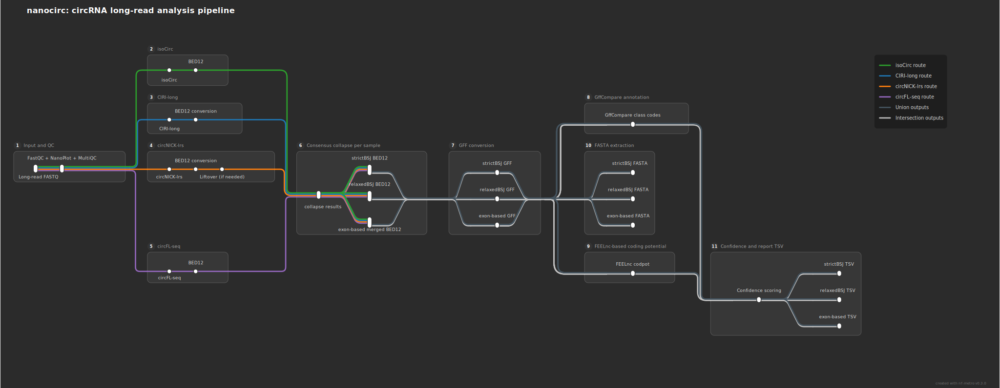

<h1>
  <picture>
    <source media="(prefers-color-scheme: dark)" srcset="docs/images/nf-core-nanocirc_logo_dark.png">
    
  </picture>
</h1>

[](https://github.com/nf-core/nanocirc/actions/workflows/nf-test.yml)
[](https://github.com/nf-core/nanocirc/actions/workflows/linting.yml)
[](https://www.nf-test.com)
[](https://www.nextflow.io/)
[](https://github.com/nf-core/tools/releases/tag/3.5.1)
[](https://sylabs.io/docs/)
[](https://www.docker.com/)

## Introduction

**nf-core/nanocirc** is a bioinformatics pipeline for the detection and characterisation of circular RNAs (circRNAs) from long-read nanopore sequencing data. It runs up to four detection tools with different algorithms in parallel, converts their outputs to a unified BED12 format, and merges results across tools with consensus confidence scoring.

The pipeline is designed for researchers who want to maximise circRNA detection sensitivity by combining complementary tools, and to obtain a ranked, confidence-scored list of circRNA candidates supported by multiple independent methods.

## Pipeline overview



The pipeline runs the following steps:

1. **Read QC** - [`FastQC`](https://www.bioinformatics.babraham.ac.uk/projects/fastqc/) and [`NanoPlot`](https://github.com/wdecoster/NanoPlot) for nanopore-specific quality metrics
2. **circRNA detection** (run in parallel):
   - [`isoCirc`](https://github.com/Xinglab/isoCirc)
   - [`CircFL-seq`](https://github.com/yangence/circfull)
   - [`CIRI-long`](https://github.com/bioinfo-biols/CIRI-long)
   - [`circnick-lrs`](https://github.com/dzhang32/circnick)
3. **BED12 conversion** - all tool outputs converted to a unified 12-column BED format
4. **Pairwise comparison** - [`bedtools intersect`](https://bedtools.readthedocs.io/) across all tool pairs with --split for exon boundaries meeting user defined reciprocal overlap fraction (default 0.95)
5. **Merging** — BSJ-based (strict and relaxed) and exon-based union/intersection
6. **Confidence scoring** - each circRNA scored on BSJ support, isoform support, and spliced-length overlap
7. **MultiQC** - [`MultiQC`](https://multiqc.info/) aggregated QC report

## Quick start

> [!NOTE]
> If you are new to Nextflow and nf-core, please refer to [this page](https://nf-co.re/docs/usage/installation) on how to set up Nextflow. Make sure to [test your setup](https://nf-co.re/docs/usage/introduction#how-to-run-a-pipeline) with `-profile test` before running the workflow on actual data.

### 1. Prepare a samplesheet

Create a CSV file listing your samples and their FASTQ paths:

```csv
sample,fastq
SAMPLE1,/path/to/sample1.fastq.gz
SAMPLE2,/path/to/sample2.fastq.gz
```

### 2. Run the pipeline

```bash
nextflow run nf-core/nanocirc \
    -profile singularity \
    --input     samplesheet.csv \
    --outdir    results/ \
    --fasta     /path/to/genome.fa \
    --gtf       /path/to/annotation.gtf \
    --circrna_db /path/to/circ_db.bed \
    --circnick_species mouse
```

> [!WARNING]
> Provide pipeline parameters via the CLI or a `-params-file`. Custom config files (`-c`) should only be used for resource tuning, not parameters.

For full parameter documentation see [docs/usage.md](docs/usage.md) or the [nf-core/nanocirc parameters page](https://nf-co.re/nanocirc/parameters).

## Key parameters

| Parameter                   | Description                                               | Default |
| --------------------------- | --------------------------------------------------------- | ------- |
| `--input`                   | Path to samplesheet CSV                                   | —       |
| `--fasta`                   | Reference genome FASTA                                    | —       |
| `--gtf`                     | Gene annotation GTF                                       | —       |
| `--circrna_db`              | circRNA database BED (required for isoCirc and CIRI-long) | —       |
| `--run_isocirc`             | Enable isoCirc                                            | `true`  |
| `--run_circfl`              | Enable CircFL-seq                                         | `true`  |
| `--run_cirilong`            | Enable CIRI-long                                          | `true`  |
| `--run_circnick`            | Enable circnick-lrs                                       | `true`  |
| `--circnick_species`        | Species for circnick-lrs: `mouse` or `human`              | —       |
| `--circnick_liftover_chain` | UCSC chain file for coordinate liftover (optional, but required if provided version of genome differs from h19 or m38. otherwise circNICK-lrs results will be incomparable with other tools)        | —       |
| `--circrna_bsj_tolerance`   | BSJ coordinate tolerance for relaxed merge (bp)           | `5`     |
| `--circrna_isoform_overlap` | Min reciprocal spliced-length overlap for isoform scoring | `0.95`  |

## Output

The main outputs are in `<outdir>/circrna/<sample>/`:

```
circrna/
└── <sample>/
    ├── bed12/                     # Per-tool BED12 files
    ├── isocirc/                   # isoCirc raw output
    ├── circfl_seq/                # CircFL-seq raw output
    ├── ciri_long/                 # CIRI-long raw output
    ├── circnick_lrs/              # circnick-lrs raw output
    └── merged/
        ├── pairs/                 # Pairwise bedtools comparisons
        ├── strict/                # Strict BSJ-based union + intersection
        ├── relaxed/               # Relaxed BSJ-based union + intersection
        └── exon_based/            # Exon structure-based union + intersection
```

Each merged directory contains BED12 files and confidence TSV files. The confidence TSV includes per-tool flags, isoform overlap fractions, and a `tool_consensus` score (Low / Medium / High).

For full output documentation see [docs/output.md](docs/output.md).

## Consensus scoring

Each circRNA receives a `tool_consensus` label based on three percentage-based components (each binned 1–4):

- **bsj_score** - fraction of active tools detecting this BSJ
- **isoform_score** - fraction of active tools with confirmed isoform structure
- **overlap_score** - average pairwise spliced-length overlap fraction

| Score (3–12) | Category |
| ------------ | -------- |
| 3–4          | Low      |
| 5–8          | Medium   |
| 9–12         | High     |

> **Note:** Scores are normalised to the number of tools that ran. A `High` from 2 tools running (both fully agree) is not equivalent to `High` from 4 tools - latter is much more confident. The pipeline warns when fewer than 4 tools are active.

### Scoring examples

**4-tool run**

| Scenario                                | bsj | iso | ovlp | total | Category |
| --------------------------------------- | --- | --- | ---- | ----- | -------- |
| All 4 agree, full isoform match         | 4   | 4   | 4    | **12** | High    |
| 3 tools agree, good isoform             | 3   | 3   | 4    | **10** | High    |
| All 4 BSJ, no isoform confirmation      | 4   | 1   | 1    | **6**  | Medium  |
| 2 tools agree, some isoform             | 2   | 2   | 3    | **7**  | Medium  |
| Only 1 tool detects this circRNA        | 1   | 1   | 1    | **3**  | Low     |

**3-tool run**

| Scenario                                | bsj | iso | ovlp | total | Category |
| --------------------------------------- | --- | --- | ---- | ----- | -------- |
| All 3 agree, full isoform match         | 4   | 4   | 4    | **12** | High    |
| 2 tools agree, good isoform             | 3   | 3   | 4    | **10** | High    |
| All 3 BSJ, no isoform confirmation      | 4   | 1   | 1    | **6**  | Medium  |
| 2 tools, no isoform                     | 3   | 1   | 1    | **5**  | Medium  |
| Only 1 tool                             | 2   | 1   | 1    | **4**  | Low     |

**2-tool run**

| Scenario                                | bsj | iso | ovlp | total | Category |
| --------------------------------------- | --- | --- | ---- | ----- | -------- |
| Both agree, full isoform match          | 4   | 4   | 4    | **12** | High    |
| Both agree, moderate isoform            | 4   | 2   | 3    | **9**  | High    |
| Both agree, no isoform                  | 4   | 1   | 1    | **6**  | Medium  |
| Only 1 tool detects                     | 2   | 1   | 1    | **4**  | Low     |

## Credits

nf-core/nanocirc was written by [Anastasia Rusakovich](https://github.com/aerusakovich).

The pipeline builds on the [nf-core](https://nf-co.re) framework and uses containers from [BioContainers](https://biocontainers.pro/).

## Citations

If you use nf-core/nanocirc in your research, please cite the tools used:

- **isoCirc**: Xin, R., Gao, Y., Gao, Y., Wang, R., Kadash-Edmondson, K. E., Liu, B., Wang, Y., Lin, L., & Xing, Y. (2021). isoCirc catalogs full-length circular RNA isoforms in human transcriptomes. Nature Communications, 12(1), 266. https://doi.org/10.1038/s41467-020-20459-8
- **CircFL-seq**: Liu, Z., Tao, C., Li, S., Du, M., Bai, Y., Hu, X., Li, Y., Chen, J., & Yang, E. (2021). circFL-seq reveals full-length circular RNAs with rolling circular reverse transcription and nanopore sequencing. eLife, 10, e69457. https://doi.org/10.7554/eLife.69457
- **CIRI-long**: Zhang, J., Hou, L., Zuo, Z., Ji, P., Zhang, X., Xue, Y., & Zhao, F. (2021). Comprehensive profiling of circular RNAs with nanopore sequencing and CIRI-long. Nature Biotechnology, 39(7), 836–845. https://doi.org/10.1038/s41587-021-00842-6
- **circnick-lrs**: Rahimi, K., Venø, M. T., Dupont, D. M., & Kjems, J. (2021). Nanopore sequencing of brain-derived full-length circRNAs reveals circRNA-specific exon usage, intron retention and microexons. Nature Communications, 12(1), 4825. https://doi.org/10.1038/s41467-021-24975-z
- **bedtools**: Quinlan, A. R., & Hall, I. M. (2010). BEDTools: A flexible suite of utilities for comparing genomic features. Bioinformatics, 26(6), 841–842. https://doi.org/10.1093/bioinformatics/btq033
- **FastQC**: Andrews, S. (2010). FastQC: a quality control tool for high throughput sequence data.
- **NanoPlot**: De Coster, W., D’Hert, S., Schultz, D. T., Cruts, M., & Van Broeckhoven, C. (2018). NanoPack: Visualizing and processing long-read sequencing data. Bioinformatics, 34(15), 2666–2669. https://doi.org/10.1093/bioinformatics/bty149
- **MultiQC**: Ewels, P., Magnusson, M., Lundin, S., & Käller, M. (2016). MultiQC: Summarize analysis results for multiple tools and samples in a single report. Bioinformatics, 32(19), 3047–3048. https://doi.org/10.1093/bioinformatics/btw354

The nf-core framework:

> Ewels, P. A., Peltzer, A., Fillinger, S., Patel, H., Alneberg, J., Wilm, A., Garcia, M. U., Di Tommaso, P., & Nahnsen, S. (2020). The nf-core framework for community-curated bioinformatics pipelines. Nature Biotechnology, 38(3), 276–278. https://doi.org/10.1038/s41587-020-0439-x
